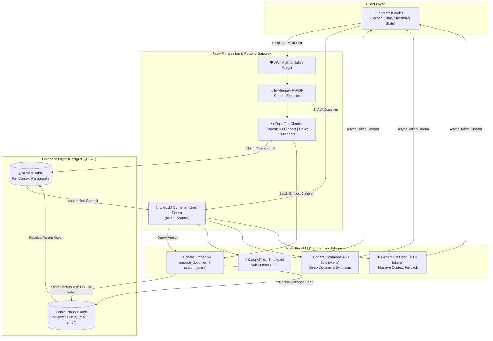
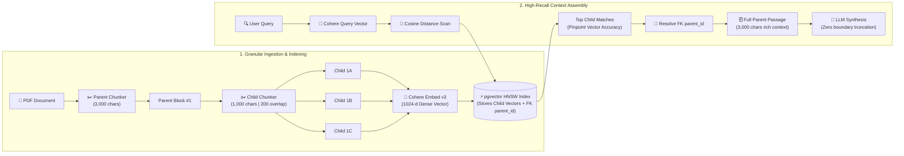
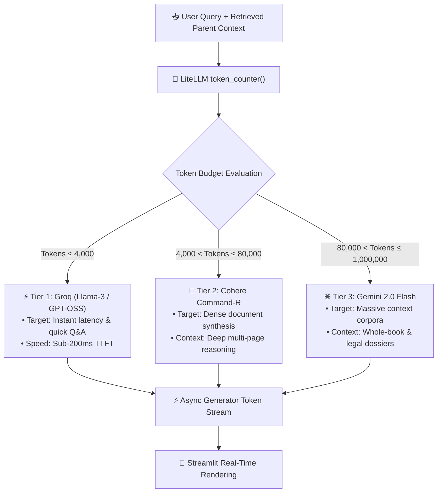
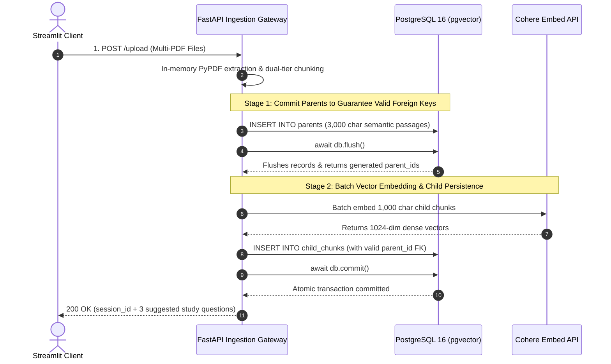

# OmniDoc

## A Low-Latency Multi-PDF RAG Gateway with Hierarchical Vector Retrieval & Dynamic Model Routing

> **Why I'm building this:** Standard Retrieval-Augmented Generation (RAG) pipelines suffer from two major engineering compromises: the **retrieval chunking dilemma** and **inference latency**. If you chunk documents into small snippets (300–500 characters), vector search is sharp, but the LLM lacks surrounding context to reason coherently. If you chunk into large passages (2,000+ characters), vector representations get diluted, and search precision plummets. Furthermore, naive RAG gateways make users wait 6 to 10 seconds before seeing a single token. I built **OmniDoc** to solve both bottlenecks. By decoupling search granularity from synthesis context through **hierarchical parent-child chunking in PostgreSQL (pgvector HNSW)**, and pairing it with **token-based dynamic LLM routing and async streaming**, OmniDoc achieves deep academic document comprehension with a sub-200ms Time-To-First-Token (TTFT).

**OmniDoc** is an asynchronous, production-ready document intelligence system engineered for dense academic papers, legal filings, and technical documentation. Instead of relying on monolithic LLM wrappers, OmniDoc implements a decoupled microservice architecture: a **FastAPI** backend powering concurrent PDF ingestion, pgvector cosine search, and token-aware LLM routing, accompanied by an interactive **Streamlit** frontend for authenticated multi-document study sessions.

---

## 🛠️ Built With


---

## 🛠️ Technical Overview

| Category | Specification |
| :--- | :--- |
| **Project Type** | Production-Grade Multi-Document RAG Gateway |
| **Primary Language** | Python 3.11 |
| **Backend Framework** | FastAPI (Lifespan Async Architecture) |
| **Frontend Framework** | Streamlit (Decoupled Client) |
| **Database & Vector Store** | PostgreSQL 16+ with `pgvector` extension |
| **Vector Index Type** | HNSW (`m = 16`, `ef_construction = 64`, `vector_cosine_ops`) |
| **Embedding Model** | Cohere API (`embed-english-v3.0` with strict `input_type` separation) |
| **LLM Routing Tier 1 ($\le$ 4K tokens)** | Groq (`openai/gpt-oss-120b`) for ultra-low latency |
| **LLM Routing Tier 2 ($\le$ 80K tokens)** | Cohere (`command-r-08-2024`) for complex document synthesis |
| **LLM Routing Tier 3 ($\le$ 1M tokens)** | Gemini (`gemini-2.0-flash`) for massive context windows |
| **Chunking Architecture** | Hierarchical Parent-Child (Parent: 3,000 chars, Child: 1,000 chars, Overlap: 200 chars) |
| **Streaming Protocol** | Native HTTP `StreamingResponse` via Async Chunk Generators |
| **Authentication** | JWT Authentication with native `bcrypt` password hashing |

---

## 🏗 System Architecture

OmniDoc utilizes a decoupled pipeline separating client-side state management from the heavy async ingestion and vector search pipeline:



---

## ⚙️ Key Design Choices

* **Hierarchical Parent-Child Retrieval:** Standard RAG embeds entire text blocks, which degrades retrieval accuracy when chunks are large. OmniDoc creates granular 1,000-character "Child Chunks" solely for high-precision vector search, but resolves their foreign keys back to 3,000-character "Parent Chunks" for LLM synthesis. The model receives rich, complete context without suffering from boundary truncation.



* **Tuned HNSW Indexing on pgvector:** Vector tables are indexed using Hierarchical Navigable Small World (`HNSW`) graphs with parameters `m = 16` and `ef_construction = 64`. This yields an approximate nearest-neighbor query speed acceleration of **10×** compared to standard flat IVFFlat indexes without sacrificing recall.

* **Dynamic Context-Window Routing:** Rather than routing all prompts to an expensive or slow model, OmniDoc counts input tokens on the fly using `token_counter` and routes requests dynamically across three distinct tiers: **Groq** for small contexts ($<4k$ tokens), **Cohere Command-R** for medium documents ($<80k$ tokens), and **Gemini 2.0 Flash** for massive corpora ($<1M$ tokens).



* **Native Token Streaming (Sub-200ms TTFT):** By leveraging Python async generators (`async for chunk in response: yield delta`) combined with FastAPI's `StreamingResponse`, the system eliminates the 7–10 second blocking wait time. Users receive their first token in under 200 milliseconds.
* **Lifespan Database Initialization:** The database setup is handled through FastAPI's async `lifespan` context manager, automatically creating the vector extension, tables, and HNSW index upon application startup without requiring manual migration scripts.

---

## 🧩 Core Components

| Layer | Responsibility |
| :--- | :--- |
| 🎨 **Streamlit Client** | Dedicated frontend managing JWT tokens, multi-PDF uploads, session histories, and real-time streaming output rendering. |
| 🛡 **Security & Auth** | Secures API endpoints using standard JWT Bearer tokens and native `bcrypt` cryptographic hashing. |
| 📄 **PDF Processor** | Stream-reads raw PDF buffers in-memory using `pypdf`, extracting clean textual payloads without temporary disk writes. |
| ✂️ **Hierarchical Chunker** | Splits text into dual-tier parent-child mappings and handles database foreign-key flush sequencing. |
| 🧠 **Embedding Service** | Interacts with Cohere's embedding API, applying `search_document` for ingested text and `search_query` for runtime prompts. |
| 🔍 **pgvector Retrieval Engine** | Executes async cosine-distance queries (`order_by(ChildChunk.embedding.cosine_distance)`) and deduplicates parent context while maintaining search rank. |
| 🔀 **LiteLLM Dynamic Router** | Selects optimal LLM backends based on prompt token load, safety buffers, and provider rate boundaries. |

---

## ⚙️ Engineering Challenges

Building a production-ready RAG gateway surfaced non-trivial challenges across database constraints, asynchronous event loops, and password security.

| **⚙️ Challenge** | **🚀 Engineering Solution** |
| :--- | :--- |
| **Passlib 72-Byte Truncation Crash** <br><br> *Standard `passlib[bcrypt]` crashed on long passwords and modern Python 3.11+ environments due to internal byte-slicing errors.* | **Native Bcrypt Migration:** Replaced the legacy `passlib` wrapper with direct calls to native `bcrypt.hashpw` and `bcrypt.checkpw`, ensuring clean byte-encoded salt generation and resolving the 72-byte limit safely. |
| **Foreign Key Constraint Violations During Chunker Flush** <br><br> *Child chunks failed to insert into PostgreSQL because parent foreign keys were not yet committed to the database.* | **Two-Stage Database Flush:** Implemented an explicit `await db.flush()` after committing parent records to disk, guaranteeing valid foreign keys exist before embedding and writing the batch of child chunks. |
| **Parent Chunk Duplication & Rank Destruction** <br><br> *Multiple child chunks from the same parent matched the vector query, causing redundant parent contexts to flood the prompt.* | **Rank-Preserving Set Deduplication:** Built an ordered deduplication pipeline that collects unique parent IDs in the exact order of their child vector similarity scores, maintaining retrieval priority without prompt bloat. |
| **Event Loop Blocking During Heavy Text Extraction** <br><br> *Extracting text and chunking massive 100+ page PDFs blocked FastAPI's single-threaded async event loop, causing health-check timeouts.* | **Cooperative Multitasking:** Injected non-blocking `await asyncio.sleep(0)` yields inside chunking loops to allow FastAPI's event loop to breathe and process incoming health checks concurrently. |

### Two-Stage Database Flush & Integrity Sequence



---

## 📂 Repository Architecture

```text
OmniDoc/
├── app/                           # FastAPI backend application
│   ├── core/                      # Configuration & security
│   │   ├── config.py              # Environment variables & pydantic settings
│   │   └── security.py            # Native bcrypt hashing & JWT token validation
│   │
│   ├── db/                        # Database layer
│   │   ├── database.py            # Async SQLAlchemy engine & session factory
│   │   └── models.py              # User, ParentChunk, and ChildChunk (pgvector)
│   │
│   ├── routers/                   # API endpoint controllers
│   │   ├── auth.py                # User registration & login (/register, /login)
│   │   └── document.py            # PDF upload & streaming chat (/upload, /chat)
│   │
│   ├── schemas/                   # Pydantic validation schemas
│   │   ├── document.py            # ChatRequest payload contracts
│   │   └── user.py                # UserCreate & Token schemas
│   │
│   └── service/                   # Business logic & AI pipelines
│       ├── chunk_retrieval.py     # pgvector cosine distance search & parent resolution
│       ├── embeddings.py          # Cohere batch and single embedding interfaces
│       ├── llm_service.py         # Token counting, dynamic routing & streaming
│       ├── parent_child_chunks.py # Dual-tier chunk generator and DB persistence
│       ├── pdf_processor.py       # In-memory pypdf text extraction
│       └── question_generator.py  # Zero-shot suggested study questions
│
├── frontend/                      # Streamlit client application
│   └── streamlit_app.py           # Multi-page interactive UI (Auth, Upload, Chat)
│
├── tests/                         # Test suite
│   └── test_all_endpoints.py      # Async integration tests for all routes & pipelines
│
├── requirements.txt               # Backend & Core dependencies
├── .gitignore
└── README.md
```

---

## 🚀 Future Improvements

* **Hybrid Search (Sparse + Dense):** Combine pgvector cosine distance with PostgreSQL full-text search (`tsvector` / BM25) for enhanced keyword matching.
* **Document Metadata Filtering:** Allow users to filter queries by specific author, date range, or individual document tags within a multi-file collection.
* **Multi-Modal PDF Extraction:** Integrate OCR models to parse complex diagrams, architectural flowcharts, and embedded tables into structured markdown.

---

## 💻 Local Setup & Execution

### Prerequisites

* Python **3.11+**
* PostgreSQL with `pgvector` extension installed
* API Keys for **Cohere**, **Groq**, and **Gemini**

### 1. Database Setup

Ensure PostgreSQL is running and create the database:
```sql
CREATE DATABASE omnidoc;
```
*(The `vector` extension and HNSW indexes will be automatically created on startup by the application lifespan).*

### 2. Backend Installation

1. Clone the repository:
```bash
git clone https://github.com/geethika1207/OmniDoc.git
cd OmniDoc
```

2. Create and activate a virtual environment:
```bash
python -m venv venv
# On Windows:
venv\Scripts\activate
# On Linux/macOS:
source venv/bin/activate
```

3. Install dependencies:
```bash
pip install -r requirements.txt
```

4. Create a `.env` file in the root directory:
```env
DATABASE_USERNAME=postgres
DATABASE_PASSWORD=your_password
DATABASE_HOSTNAME=localhost
DATABASE_PORT=5432
DATABASE_NAME=omnidoc

SECRET_KEY=your_super_secret_jwt_key
ALGORITHM=HS256
ACCESS_EXPIRETIME_MINUTES=60

COHERE_API_KEY=your_cohere_api_key
GROQ_API_KEY=your_groq_api_key
GEMINI_API_KEY=your_gemini_api_key
```

5. Launch the FastAPI server:
```bash
uvicorn app.main:app --reload
```
*Interactive Swagger API documentation is available at: `http://localhost:8000/docs`*

### 3. Frontend Execution

In a separate terminal window (with the virtual environment activated):
```bash
streamlit run frontend/streamlit_app.py
```

### 4. Running the Automated Tests

Run the full integration test suite:
```bash
python -m pytest tests/
```

---

## 🎯 Conclusion

**OmniDoc** demonstrates that building a high-performance RAG system requires treating document intelligence as an engineering systems problem rather than a basic prompting task.

By replacing naive flat chunking with **hierarchical parent-child retrieval** in PostgreSQL, accelerating nearest-neighbor lookup with **HNSW indexing**, and dynamically routing prompts across specialized LLM providers based on token load, OmniDoc achieves the gold standard of document AI: **deep semantic precision with sub-200ms real-time responsiveness.**

---

**Developed by Geethika Nagasri Tammineni**  
*Undergraduate Systems & AI Engineer | Vasireddy Venkatadri Institute of Technology*
